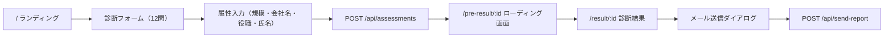

# P3 PPM Maturity Checker — 仕様概要

## 1. プロダクト概要

**P3 PPM Maturity Checker** は、IT企業・受託開発組織を対象としたプロジェクトポートフォリオマネジメント（PPM）の成熟度診断Webアプリケーション。12問の質問に回答するだけで、組織のPPM成熟度を4カテゴリで可視化し、優先改善領域と具体的アクションを提案する。

**運営**: P3 Strategic Partners Co., Ltd.  
**本番URL**: `https://checker.pthree.app`

---

## 2. 技術スタック

| レイヤー           | 技術                                   |
| ------------------ | -------------------------------------- |
| **フロントエンド** | React 18 + TypeScript + Vite           |
| **UIライブラリ**   | shadcn/ui (Radix UI) + Tailwind CSS    |
| **状態管理**       | TanStack React Query + React Hook Form |
| **ルーティング**   | wouter                                 |
| **チャート**       | Recharts                               |
| **アニメーション** | Framer Motion                          |
| **バックエンド**   | Express 5 (Node.js)                    |
| **ORM**            | Drizzle ORM                            |
| **データベース**   | PostgreSQL                             |
| **メール送信**     | Resend API                             |
| **バリデーション** | Zod                                    |
| **ホスティング**   | Replit                                 |

---

## 3. 画面構成・ユーザーフロー



### 3.1 ランディングページ (`/`)

- ヘッダー、ヒーローセクション、特徴紹介、フッター
- `AssessmentForm` コンポーネントを埋め込み

### 3.2 診断フォーム (AssessmentForm)

- 12問を1問ずつステップ形式で表示（プログレスバー付き）
- 各質問で **成熟度**（Slider: 0-3）と**重要度**（RadioGroup: 1-3）を入力
- 全12問回答後に属性入力画面（従業員規模、会社名、役職、氏名）を表示
- 送信時にAPIへPOST後、`/pre-result/:id` へ遷移

### 3.3 ローディング画面 (`/pre-result/:id`)

- 2秒間のローディングアニメーション後、`/result/:id` へ自動遷移

### 3.4 結果画面 (`/result/:id`)

- 優先改善カテゴリの特定とフィードバック表示
- レーダーチャート（カテゴリ別成熟度 vs 理想値3.0）
- 散布図（重要度 × 成熟度マトリクス）
- 詳細スコアテーブル（カテゴリ別成熟度・重要度・リスクスコア・判定）
- CTA（カテゴリに応じた白書PDFのダウンロード誘導）
- メール転送ダイアログ

---

## 4. データモデル

### assessments テーブル

| カラム       | 型               | 説明                                                         |
| ------------ | ---------------- | ------------------------------------------------------------ |
| `id`         | SERIAL (PK)      | 自動採番ID                                                   |
| `answers`    | JSONB            | `{ [questionId]: { maturity: number, importance: number } }` |
| `user_info`  | JSONB (nullable) | `{ companyName?, role?, companySize?, name? }`               |
| `email`      | TEXT (nullable)  | メール送信時に後追い更新                                     |
| `created_at` | TIMESTAMP        | 作成日時                                                     |

> **注意**: `companySize`（従業員規模）はフォーム送信時にDBの`userInfo`フィールドに保存され、さらに`localStorage`にも`assessment_size_{id}`キーで保存される（結果表示時に参照）。

---

## 5. API仕様

### `POST /api/assessments`

- **入力**: `CreateAssessmentRequest`（answers, email?, userInfo?）
- **レスポンス**: 201 — 作成されたアセスメントレコード / 400 — バリデーションエラー

### `GET /api/assessments/:id`

- **レスポンス**: 200 — アセスメントレコード / 404 — 見つからない

### `POST /api/send-report`

- **入力**: `{ email, name?, assessmentId?, resultUrl, reportData }`
- **処理**:
  1. アセスメントレコードの`email`フィールドを更新
  2. 優先カテゴリに応じた白書PDF（`server/whitepapers/`）を添付
  3. Resend APIでHTMLメールを送信
- **レスポンス**: 200 — 送信成功（Resend送信失敗時もDB保存は成功として200を返す）

---

## 6. スコアリングロジック

> 詳細は [scoring-logic.md](./scoring-logic.md) を参照

| 要素             | 計算式                                                                    |
| ---------------- | ------------------------------------------------------------------------- |
| **リスクスコア** | `(3 - 成熟度) × 重要度`                                                   |
| **カテゴリ平均** | 所属3問の合計 ÷ 3                                                         |
| **優先カテゴリ** | リスクスコア合計が最大 → 同点時は重要度高 → 成熟度低                      |
| **判定**         | 成熟度 < 1.5 かつ 重要度 > 2 → 危険 / 成熟度 < 2 → 注意 / それ以外 → 良好 |

---

## 7. 質問定義

4カテゴリ × 3問 = 計12問

| ID  | カテゴリ       | 質問タイトル       |
| --- | -------------- | ------------------ |
| A1  | 稼働管理       | 工数入力率         |
| A2  | 稼働管理       | 予実一元把握       |
| A3  | 稼働管理       | PM負荷見える化     |
| B1  | スキル・配員   | スキルアサイン     |
| B2  | スキル・配員   | 炎上防止           |
| B3  | スキル・配員   | 要件定義(型)化     |
| C1  | 収益性管理     | 見積り根拠標準化   |
| C2  | 収益性管理     | 乖離要因特定       |
| C3  | 収益性管理     | 撤退基準明確化     |
| D1  | プロセス成熟度 | RAID管理標準化     |
| D2  | プロセス成熟度 | 経営ダッシュボード |
| D3  | プロセス成熟度 | リソース調整会議   |

---

## 8. メール送信・白書配信

優先改善カテゴリに対応する白書PDFをメールに添付：

| カテゴリ | ファイル         | 表示名                    |
| -------- | ---------------- | ------------------------- |
| A        | `category-A.pdf` | PPM白書\_工数管理.pdf     |
| B        | `category-B.pdf` | PPM白書\_リソース管理.pdf |
| C        | `category-C.pdf` | PPM白書\_収益管理.pdf     |
| D        | `category-D.pdf` | PPM白書\_経営管理.pdf     |

メール本文にはカテゴリ別のリードテキスト、診断結果サマリ、結果ページへのリンクが含まれる。

---

## 9. ディレクトリ構成

```
ppm-maturity-checker/
├── client/src/
│   ├── components/
│   │   ├── AssessmentForm.tsx   # 診断フォーム（12問ステップ＋属性入力）
│   │   └── ui/                  # shadcn/ui コンポーネント群
│   ├── hooks/
│   │   └── use-assessments.ts   # API通信フック
│   ├── lib/
│   │   ├── questions.ts         # 質問定義・カテゴリ定義・企業規模選択肢
│   │   ├── queryClient.ts       # TanStack Query 設定
│   │   └── utils.ts             # ユーティリティ
│   └── pages/
│       ├── Landing.tsx           # ランディングページ
│       ├── PreResult.tsx         # ローディング画面
│       └── Result.tsx            # 診断結果画面（スコアリングロジック含む）
├── server/
│   ├── index.ts                 # Express サーバーエントリーポイント
│   ├── routes.ts                # APIルート定義・メール送信処理
│   ├── storage.ts               # DB操作レイヤー（Drizzle ORM）
│   ├── db.ts                    # DB接続設定
│   ├── resend.ts                # Resend API クライアント
│   ├── github.ts                # GitHub連携（Replit Connector経由）
│   └── whitepapers/             # 白書PDF（4ファイル）
├── shared/
│   ├── schema.ts                # テーブル定義・Zodスキーマ・型定義
│   └── routes.ts                # APIコントラクト定義
└── drizzle.config.ts            # Drizzle Kit 設定
```

---

## 10. 既知の制約・注意事項

- **スコアリングロジックはクライアントサイドのみ**: サーバー側でスコア計算は行わない
- **「要改善」ラベルがハードコード**: 結果画面の「総合リスクレベル：要改善」は動的に算出されていない
- **企業規模の二重保存**: `userInfo.companySize`（DB）と `localStorage`（`assessment_size_{id}`）の両方に保存
- **Replit依存**: Resend / GitHub連携がReplit Connectorを前提としている
